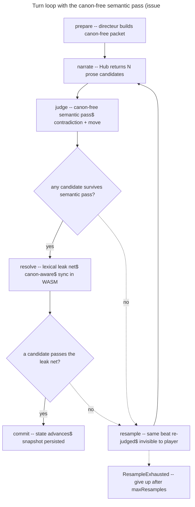

<!-- Living plan for issue #39. Exploratory / low-priority (parent #33). English only. -->

# Instruction: Semantic "quality" verifier (issue #39)

## Feature

- **Summary**: The current verifier (`engine/core/src/verifier.rs`) is a lexical token checklist folded on accents/case: leak (`Fuite`) / contradiction (`Contradiction`) / move-executed (`MoveNonExecute`). Robust but purely substring-based. This plan replaces it with **sense-based** detection where sense is actually needed, **without changing the contract shape** (`Rejet::{Fuite, Contradiction, MoveNonExecute}`) nor the loop coupling (invisible resample), and **without moving the canon wall** (canon stays behind the wall, `/narrate` stays blind to canon).
- **Stack**: `Rust 2021 (workspace: cn-core / cn-wasm / harness)` · `wasm-bindgen` · `serde` · `TypeScript 5.7` · `Astro 5` · `vitest 2.1` · `pnpm 10.5`
- **Branch name**: `feat/39-verifier-semantique`
- **Parent Plan**: issue #33 (Hub / relais narrateur) — `none` as a plan file
- **Sequence**: `standalone` (depends on #36 `/narrate` service being reachable for the live judge; the stub path is testable now)
- Confidence: 9/10
- Time to implement: ~2-3 focused sessions (Phase 1 is a decision, not code)

## The central decision (Phase 1 gate)

The issue's own open question is **where the semantic judge lives**, because the three checks do NOT have the same relationship to the secret:

| Check | Needs the secret (canon)? | Consequence |
| --- | --- | --- |
| `Fuite` (leak) | **Yes** — to know what "naming the secret" means semantically | A canon-aware LLM judge would have to receive the canon → the secret leaves the client → **the wall moves**. |
| `Contradiction` | **No** — contradiction is against *established public facts* (`faits_etablis`), already canon-free | Can be judged by a **canon-free** LLM, co-located with `/narrate`, blind to canon. |
| `MoveNonExecute` | **No** — "does the prose enact the chosen move" reads only public packet fields (`move`, `revealable`) | Same: **canon-free** semantic judgement, no wall move. |

Structural fact that forces the shape of the solution: `Engine::resolve()` is **synchronous** and runs inside WASM (`engine/wasm/src/lib.rs`); the **only** async seam in the host loop is `narrator.narrate()` (`src/scripts/narrative/session.ts`). An LLM judge is async → it **cannot** run inside `resolve()` as structured today.

**Recommended option (A)** — asymmetric split, wall preserved:

- `Fuite` stays **lexical + canon-aware + client-side + synchronous** in `verifier()` (it is the ONE check that truly needs the secret; a lexical net there is defensible and keeps the wall intact). It remains the authoritative hard net inside `resolve()`.
- `Contradiction` + `MoveNonExecute` become a **canon-free semantic judge** (`/judge`, sibling of `/narrate`, blind to canon), invoked in the host loop as an async pass. Because it never sees the secret, the wall does not move.
- The `Rejet` contract is unchanged; the invisible-resample mechanism is unchanged (a semantically-rejected batch triggers the same resample path).

**Rejected/deferred options** (recorded in the ADR):
- **(B)** Canon-aware LLM leak judge → moves the wall (secret reaches a provider). Deferred; only pursue if the product explicitly accepts it.
- **(C)** Judge as advisory quality-ranking only (never a hard reject) → smallest, but does not make contradiction detection "by sense" as the issue asks. Kept as a fallback if the semantic judge proves too noisy.

## Architecture projection

<!-- Validated with the user before plan finalization. -->

### Files to modify

- `engine/core/src/verifier.rs` - split the checklist: keep `Fuite` as the authoritative lexical net; document that `Contradiction`/`MoveNonExecute` become the semantic judge's responsibility. Contract (`Rejet`, `Verdict`) unchanged.
- `engine/core/src/engine.rs` - `resolve()` keeps applying the lexical leak net (canon-aware, sync); no signature or `Outcome`/resample change. Optionally expose a canon-free "judgeable view" of a candidate for the host.
- `src/scripts/narrative/session.ts` - insert an async, canon-free semantic pass (contradiction + move) between `narrate` and `resolve`; preserve the resample loop and `ResampleExhausted`.
- `src/scripts/narrative/narrator.ts` - factor the shared HTTP/error plumbing so the `/judge` client can reuse it (typed error codes, endpoint/token).
- `src/scripts/narrative/runtime-config.ts` - resolve the `Judge` (stub vs Hub) exactly like `resolveNarrator()`, keyed on a `PUBLIC_JUDGE_ENDPOINT` + the existing Muse token.
- `engine/harness/src/main.rs` - keep the terminal harness green with the lexical net; add an optional flag to exercise a stub semantic judge.

### Files to create

- `aidd_docs/decisions/2026_07-verifier-judge-placement.md` - ADR recording the Phase 1 decision (where the judge lives, the asymmetric split, options B/C rejected/deferred).
- `src/scripts/narrative/judge.ts` - canon-free `Judge` interface + `HttpJudge` (contradiction + move, per-candidate semantic verdict returning the same `Rejet` variants).
- `src/scripts/narrative/stub-judge.ts` - deterministic stub judge (mirrors `StubNarrator`) so the loop and tests run without a network.
- `src/scripts/narrative/session.test.ts` (or extend existing) - loop tests: semantic reject → resample, leak still cut by the lexical net, contract shape unchanged.
- `engine/core/tests/verifier_seam.rs` - lock the invariant that `resolve()` still cuts leaks lexically and still emits the exact `Rejet` variants after the split.

### Files to delete

- none — the lexical checklist is deliberately **kept** as the fast leak net (explicit in the issue: "garder la checklist par jetons comme filet lexical rapide").

## Applicable rules

<!-- Project rule inventory: the only rule file is .claude/rules/08-design/design-system.md (Gate 1), scoped to HTML / .astro / CSS design vocabulary. This change touches Rust + TS logic (session.ts, judge.ts, verifier.rs) and no .astro / CSS / design classes → the design-system gate does NOT apply. -->

| Tool | Name | Path | Why it applies |
| ---- | ---- | ---- | -------------- |
| none | — | — | No installed project rule applies (design-system gate is scoped to `.astro`/CSS design vocabulary; this change is Rust/TS logic only). User-level workflow only: use `pnpm` (not npm), prefix commands with `rtk`. |

## User Journey

## Risk register

| Risk | Impact | Mitigation |
| ---- | ------ | ---------- |
| Judge placement moves the wall | A canon-aware leak judge would exfiltrate the secret to a provider | Phase 1 decides option A: leak stays lexical + client-side; the judge is canon-free by construction (it never receives canon). ADR records the boundary. |
| Semantic judge is an extra async round-trip + credits | Latency and Muse-credit cost per turn rise | Judge is optional (stub fallback when `PUBLIC_JUDGE_ENDPOINT` unset); can run in the same call as `/narrate` if the Hub co-locates it; lexical net alone still ships the demo. |
| Resample decision partly moves into the host | Where "all rejected" is decided shifts from `resolve()` to the host pass | Keep `resolve()` authoritative for leak; the host pass only pre-filters contradiction/move and reuses the SAME resample loop + `ResampleExhausted`; lock with `session.test.ts`. |
| Judge false-positives reject valid prose | Turns fail to commit, resample exhausts | Fallback option C (advisory ranking, no hard reject); tune with a small labelled set; keep `maxResamples` guard. |
| Contract drift | `Rejet` / `Outcome` shape changes break `ts-rs` generated types + UI | Do NOT touch the enums; `engine/core/tests/verifier_seam.rs` + existing `packet_challenge.rs` / `scene_spec.rs` pin the shape; regen types (`pnpm gen:types`) must be a no-op diff. |

## Implementation phases

### Phase 1: Decide where the judge lives (ADR)

> Turn the issue's open question into a recorded decision. No production code.

#### Tasks

1. Write `aidd_docs/decisions/2026_07-verifier-judge-placement.md`: the three-check asymmetry table, the sync-WASM/async-seam constraint, option A (recommended) vs B (wall-moving, deferred) vs C (advisory fallback).
2. State the invariant to preserve verbatim: `Rejet::{Fuite, Contradiction, MoveNonExecute}` and the invisible-resample coupling do not change.
3. Get explicit sign-off on option A before any code.

#### Acceptance criteria

- [ ] ADR exists and names the chosen option with its wall-placement rationale.
- [ ] The "no contract change / no resample change / no wall move" invariant is written down.
- [ ] User has approved the placement.

### Phase 2: Freeze the seam (lexical net + judge port), zero behavior change

> Introduce the abstraction without changing any observable behavior; all existing tests stay green.

#### Tasks

1. In `verifier.rs`, keep `verifier()` and `Rejet`/`Verdict` intact; document the leak net as the authoritative lexical layer and mark contradiction/move as delegatable to the semantic judge.
2. Add `engine/core/tests/verifier_seam.rs` pinning: leak still cut lexically; the exact `Rejet` variants still emitted; `Outcome::ResampleNeeded` still produced when all invalid.
3. Define the host-side canon-free `Judge` interface in `src/scripts/narrative/judge.ts` (input: public packet fields + candidate; output: per-candidate `Rejet | null`, restricted to `Contradiction | MoveNonExecute`).
4. Add `stub-judge.ts` returning "all pass" (or scripted) deterministically; wire `resolveJudge()` in `runtime-config.ts` with a stub fallback.

#### Acceptance criteria

- [ ] `pnpm test:engine` and `pnpm test` pass with no diff in behavior.
- [ ] `pnpm gen:types` produces a no-op diff (contract types unchanged).
- [ ] `Judge` interface compiles and is covered by a stub; loop still uses only the lexical net until Phase 3 flips it on.

### Phase 3: Canon-free semantic pass in the loop

> Wire the judge as an async pass between narrate and resolve; preserve resample.

#### Tasks

1. In `session.ts`, after `narrate` and before `resolve`, run the `Judge` on candidates; drop those with a `Contradiction`/`MoveNonExecute` semantic reject.
2. If no candidate survives the semantic pass, take the SAME resample branch (increment, re-narrate, respect `maxResamples` → `ResampleExhausted`).
3. Feed survivors to `engine.resolve()`, which still applies the authoritative lexical leak net.
4. Add `session.test.ts` cases: semantic contradiction → resample; leak still cut by `resolve`; `Rejet` shape unchanged; stub judge keeps tests offline.
5. Implement `HttpJudge` against the `/judge` Hub endpoint (blind to canon), reusing the narrator's typed-error plumbing.

#### Acceptance criteria

- [ ] With the stub judge, `pnpm test` covers semantic-reject → resample and leak-cut paths.
- [ ] The packet sent to `/judge` contains no canon (asserted in a test, mirroring `prepare_produit_un_paquet_canon_free`).
- [ ] Resample count and `ResampleExhausted` semantics are unchanged.

### Phase 4: Harness + demo tuning

> Prove the loop end-to-end and keep the terminal harness usable.

#### Tasks

1. Add an optional flag to `engine/harness/src/main.rs` to run with a stub semantic judge (lexical-only remains the default).
2. Dry-run the docker scene: confirm variety/pertinence improve and no secret appears in trace.
3. Record tuning notes (thresholds, false-positive handling, fallback to option C if needed) in the ADR.

#### Acceptance criteria

- [ ] Harness runs green with and without the judge flag.
- [ ] A manual docker-scene run shows the semantic pass rejecting a semantically-off candidate that the lexical net would have missed.
- [ ] No secret token appears in the harness trace.

## Amendments

<!-- AI-initiated changes during implementation. Each entry is prefixed with 🤖. -->

## Log

<!-- APPEND ONLY. One entry per step attempt. Never rewrite. -->

## Validation flow demonstration

1. `pnpm test:engine` → cargo core tests pass, including `verifier_seam.rs` (leak still cut, `Rejet` shape intact).
2. `pnpm test` → vitest passes, including `session.test.ts` (semantic contradiction → resample; canon-free `/judge` packet).
3. `pnpm gen:types` → no diff (contract unchanged).
4. Run the harness with the judge flag on the docker scene → a semantically-off candidate is rejected that the lexical net alone would have committed; no secret in trace.
